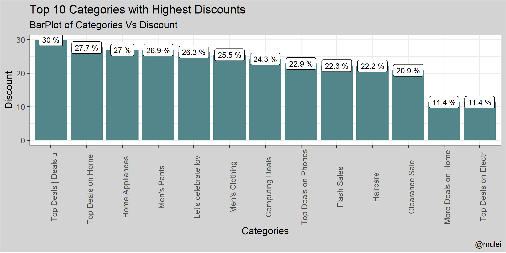
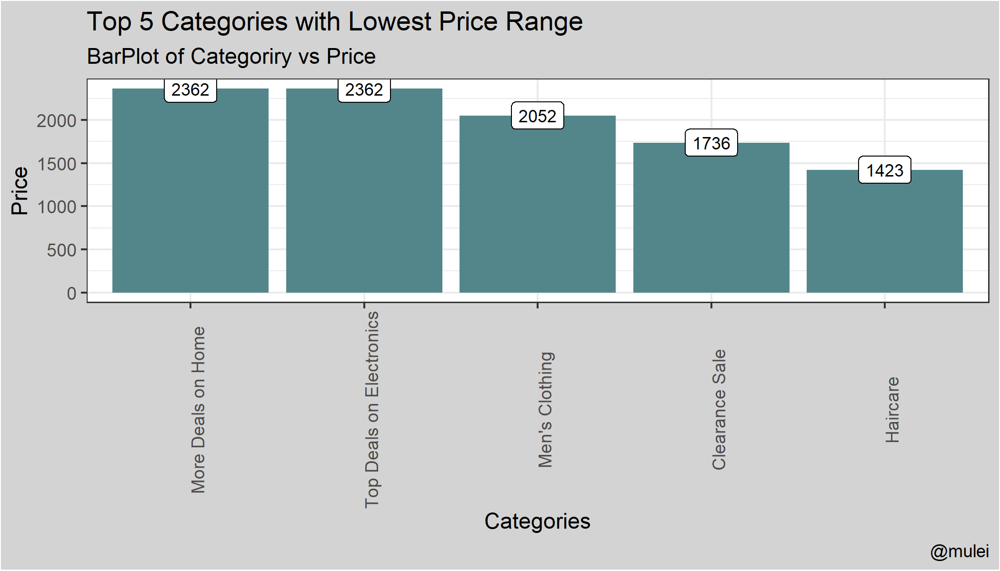
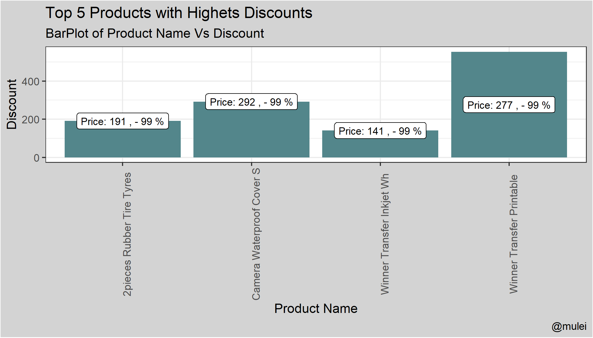

# Jumia Web Scraping Dashboard

# Introduction
Jumia is a Pan-African E-commerce company that is delivers a marketplace, logistic and payment services ecosystem. Just like Amazon, one of its competitors, its forms a system of online purchase and delivery of products. Kenya, is one of the economies significantly influenced by the operations and presence of the E-commerce company, with the domain name [**jumia.co.ke**](https://www.jumia.co.ke/).

What is Web Scraping? It is extracting data from a website i.e. it is a form of gathering and copying from the web, specific data. Scraping a website consist of; fetching it and extracting from it your desired information in a format more useful to the user. Although  web scraping can be done manually, automated tools/ software is used due to their efficiency and speed, and R-Studio software efficiently performs scraping through the **rvest** library.

 In this project, we will automate the extraction of products data from the  Kenyan domain Jumia website, and form an efficient and faster way to search and traverse the products data unlike in the website.
# Problem Statement
A lot of time is spent by users in traversing E-commerce websites while in search of desired products/offers. Advancements have been done to these websites in order to ease this search process, by categorizing their products and personalizing them to users’ needs.
In this project, by extracting the Jumia’s Website data and dispensing it in a tabular form, it will efficiently offer an easier and faster way for users to search, filter and interact with products and their prices, hence saving on both internet costs and time spent on these websites.
 Through use of R-Studio software and programming language , we will create an automated website that  extracts products data and delivers it in tabular form for easier accessibility of offers  on product’s discounts and prices.
# Main Objective
To develop a website dashboard, that offers real time delivery of Jumia’s website product’s data in a way easily accessible to users.
# Specific Objectives
1.	Extract all products data from the [Jumia’s Website](https://www.jumia.co.ke/) home page.
2.	To create a dashboard that delivers the scraped data for easier traversal and accessibility. 
3.	Deployment of the dashboard, for easier public and remote use.
# Data Analysis
The data used in analysis was extracted on 7th February, 2024 from the  [Jumia’s Website](https://www.jumia.co.ke/), which is an E-commerce website containing listed products prices and discounts. The scraped data and contains `14,724` rows of products with products attributes like; 
- **Name** : Name of the product as listed in the website
- **Price**: Price of the product as listed in the website
- **Discount**: Discount of the product as listed in the website 
- **Category**: Category the product is contained in.

After web scraping, data cleaning undertaken to the data were;
* Handling Missing Values: Products listed without listed discounts contained null values, hence the null values were replace with the value `0`.
* Data Type Conversion: Character type of the `Price` and `Discount` columns were converted to Numeric type.

After data cleaning, and Exploratory Data Analysis was conducted and the following patterns were identified;

# Conclusion

